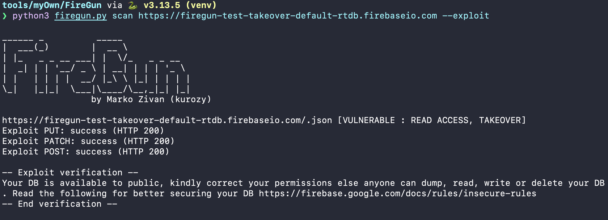
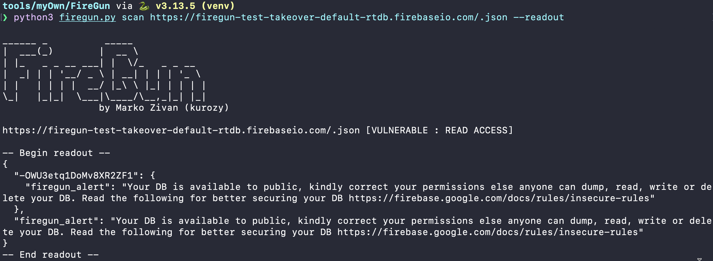
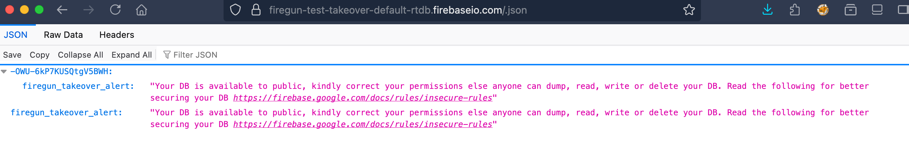

# FireGun CLI

---
Disclaimer

All information contained in this repository is provided for educational and research purposes only. The author is not responsible for any illegal use of this tool.

It is a specialized cloud security tool that helps both pentesters and security professionals.

---

**FireGun** is a Python 3.13 CLI tool for pentesting Firebase and Google Cloud Platform (GCP) projects. It provides comprehensive security testing capabilities:

## Firebase Security Tests

* **Realtime Database (RTDB)** scanning:

  * Read access checks
  * Takeover (write) testing with customizable exploit payload
  * Optional authenticated scans via `idToken` or `auth` in config
  * Deep JSON dump of entire RTDB tree
  * `--readout` flag to print DB contents on read access
* **Firestore** scanning (client‑side via REST API):

  * Read access checks
  * Takeover testing by writing a probe document
  * Nested enumeration of collections and sample documents
* **Firestore Admin SDK** export:

  * Full recursive dump of collections & documents, bypassing security rules
* **Firebase Storage** scanning:

  * Read/write access testing
  * Public file access detection
* **Security Rules fuzzing**:

  * Hook into external JavaScript scripts for dynamic rule testing
* **Custom script runner**:

  * Execute any JS extension via `script` subcommand
* **Authentication helpers**:

  * `signup` and `signin` with Firebase Identity Toolkit REST API

## Google Cloud Platform Security Tests

* **Google Cloud Storage (GCS)** scanning:

  * Public bucket access detection
  * IAM policy misconfiguration checks
  * ACL (Access Control List) analysis
  * Public read/write access testing with PoC evidence
  * Object enumeration and access testing

* **Cloud Functions** security testing:

  * Public access detection
  * IAM policy misconfigurations
  * Ingress settings validation
  * Function endpoint accessibility testing

* **Cloud Run** security testing:

  * Public service access detection
  * IAM policy analysis
  * Endpoint accessibility validation

* **App Engine** security testing:

  * Public application access detection
  * Default hostname accessibility testing

* **Cloud SQL** security testing:

  * Public IP detection
  * Authorized networks analysis
  * Detection of 0.0.0.0/0 (public access) misconfigurations

* **API Key** validation:

  * API key exposure testing
  * Validation against multiple Google APIs
  * Security recommendations

---

## Demo
1. Expliting the misconfigured firebase

2. Reading the content of the misconfigured firebase

3. Verifying exploited firebase


---

## Installation

1. Clone this repo or download `firegun.py` into your PATH.
2. Create a virtual environment and install dependencies:

   ```bash
   python3 -m venv venv
   source venv/bin/activate
   pip install httpx requests firebase-admin google-cloud-firestore
   ```
3. Make executable:

   ```bash
   chmod +x firegun.py
   ```
Or

Install with the pipx command
```bash
pipx install git+https://github.com/KurozyOS/firegun.git
```

---

## Usage

Run `./firegun.py -h` to see top‑level commands:

```bash
$ ./firegun.py -h
usage: firegun.py [-h] {scan,dump-rtdb,fs-scan,admin-dump-fs,fuzz-rules,script,signup,signin} ...

FireGun CLI

positional arguments:
  {scan,dump-rtdb,fs-scan,admin-dump-fs,fuzz-rules,script,signup,signin}
    scan            RTDB scan
    dump-rtdb       Deep RTDB JSON dump
    fs-scan         Client-side Firestore tests
    admin-dump-fs   Admin SDK Firestore dump
    fuzz-rules      Fuzz Firestore Security Rules
    script          Run custom JS extension
    signup          Email/password sign-up
    signin          Email/password sign-in

optional arguments:
  -h, --help       show this help message and exit
```

### 1. Scan Realtime Database

```bash
# Unauthenticated read/write test
./firegun.py scan your-db.firebaseio.com

# Authenticated test (load idToken from config.json)
./firegun.py scan your-db.firebaseio.com --config config.json

# Attempt takeover exploit + verify write !IT CAN REMOVE THE ORIGINAL CONTENT!
./firegun.py scan your-db.firebaseio.com --exploit

# Print DB data on read access
./firegun.py scan your-db.firebaseio.com --readout

# Combine all flags
./firegun.py scan your-db.firebaseio.com --config config.json --exploit --readout
```

> **config.json** example:
>
> ```json
> {
>   "idToken": "<FIREBASE_ID_TOKEN>"
> }
> ```

### 2. Dump Entire RTDB

```bash
./firegun.py dump-rtdb your-db.firebaseio.com --output rtdb_dump.json
```

### 3. Firestore Client Tests

```bash
./firegun.py fs-scan my-project --api-key YOUR_API_KEY
./firegun.py fs-scan my-project --api-key YOUR_API_KEY --exploit
```

### 4. Firestore Admin Export

```bash
./firegun.py admin-dump-fs --service-account service-account.json my-project --output fs_dump.json
```

### 5. Fuzz Security Rules

```bash
./firegun.py fuzz-rules firestore.rules my-project --api-key YOUR_API_KEY --script fuzz.js
```

### 6. Custom JS Extensions

```bash
./firegun.py script my_custom.js https://your-db.firebaseio.com
```

### 7. Authentication Helpers

```bash
# Sign up new user
./firegun.py signup --api-key YOUR_API_KEY user@example.com password123

# Sign in existing user
./firegun.py signin --api-key YOUR_API_KEY user@example.com password123
```

### 8. Google Cloud Storage Security Scan

```bash
# Scan GCS buckets for misconfigurations
./firegun.py gcs-scan my-bucket-name another-bucket

# With exploit attempt (tests write access)
./firegun.py gcs-scan my-bucket-name --exploit

# With access token for authenticated checks
./firegun.py gcs-scan my-bucket-name --access-token YOUR_TOKEN

# JSON output
./firegun.py gcs-scan my-bucket-name --json
```

### 9. API Key Security Check

```bash
# Validate and check API key security
./firegun.py api-key-check YOUR_API_KEY

# JSON output
./firegun.py api-key-check YOUR_API_KEY --json
```

### 10. Cloud Functions Security Scan

```bash
# Scan Cloud Functions in a project
./firegun.py cloud-functions my-project-id

# Scan specific region
./firegun.py cloud-functions my-project-id us-central1

# With access token
./firegun.py cloud-functions my-project-id --access-token YOUR_TOKEN
```

### 11. Cloud Run Security Scan

```bash
# Scan Cloud Run service (full path required)
./firegun.py cloud-run projects/my-project/locations/us-central1/services/my-service

# With access token
./firegun.py cloud-run projects/my-project/locations/us-central1/services/my-service --access-token YOUR_TOKEN
```

### 12. App Engine Security Scan

```bash
# Scan App Engine application
./firegun.py app-engine my-project-id

# With access token
./firegun.py app-engine my-project-id --access-token YOUR_TOKEN
```

### 13. Cloud SQL Security Scan

```bash
# Scan Cloud SQL instance (full path required)
./firegun.py cloud-sql projects/my-project/instances/my-instance

# With access token
./firegun.py cloud-sql projects/my-project/instances/my-instance --access-token YOUR_TOKEN
```

---

## Proof of Concept (PoC) Evidence

FireGun v2.0 includes comprehensive PoC evidence for all detected vulnerabilities:

- **HTTP Response Codes**: Status codes proving access
- **Response Previews**: Sample responses showing successful access
- **Uploaded Files**: Proof of write access via probe files
- **Accessible URLs**: Direct URLs demonstrating public access
- **IAM Policies**: Full IAM policy details showing misconfigurations
- **Metadata**: Bucket/instance metadata revealing security issues

All PoC evidence is included in JSON output when using `--json` flag.

---

## Security Testing Best Practices

1. **Always get written authorization** before testing any infrastructure
2. **Use `--exploit` flag carefully** - it creates non-destructive markers but may be logged
3. **Review PoC evidence** in JSON output for detailed vulnerability information
4. **Use access tokens** when you have legitimate access to test authenticated scenarios
5. **Start with read-only scans** before attempting write tests

---

## ToDo List
- [x] Google Cloud Storage security testing
- [x] Cloud Functions security testing
- [x] Cloud Run security testing
- [x] App Engine security testing
- [x] Cloud SQL public access detection
- [x] API key validation
- [x] Enhanced PoC evidence collection
- [ ] Cloud Pub/Sub security testing
- [ ] Cloud BigQuery security testing
- [ ] Enhanced reporting with HTML output

## License

GNUv3 © Marko Zivan (kurozy)

